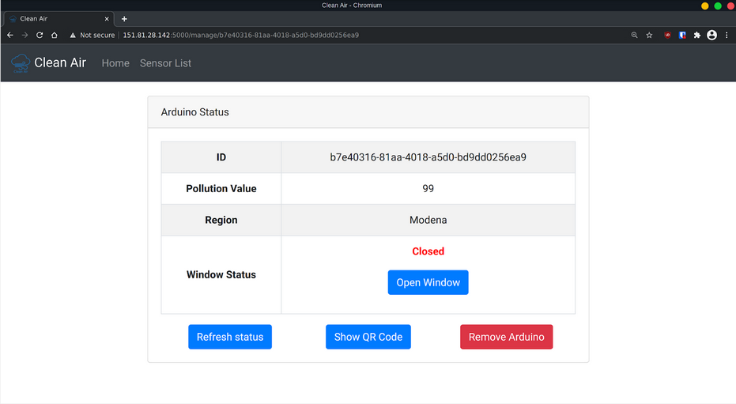
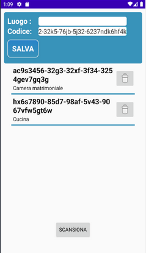

# Clean Air
*IoT & 3D intelligent systems project 2020-2021*

**Clean Air** is a automatic system able to keep the internal air quality at best possible level, measuring the internal CO2 and the external PM10 and PM25. It opens the windows when the volume of CO2 is high and the PMs values are low enough.

## Structure

| Description       |      Codebase     |
|-------------------|:-----------------:|
| Database          |       SQLite      |
| Web App Backend   |    Python/Flask   |
| Web App Frontend  | Jinja2/Javascript |
| Android App       |        Java       |
| Predictions       |      Prophet      |
| Window Controller |    Arduino/C++    |
| Communications    |     HTTP/MQTT     |

## Web App

The Web App is the centre of this system. The backend part manages the database and all the requests, while in the frontend is possible to manage ones dispositives and remotely activate them.

## Android App
The Smartphone Client let us add new devices to our profile via QRCode and manage them.

## Predictions

Our system is also able to predict PM10 and PM25 pollution values in order to keep the window close even before that the air quality starts worsening. To train the model we use Prophet with open source datasets of italian cities. In production the datasets keep growing thanks to the sensors and the model keeps getting retrined and fine tuned.

## Credits
| Name               |                      Github                      | LinkedIn                                                         |
|--------------------|:------------------------------------------------:|------------------------------------------------------------------|
| Aniello Panariello | [@apanariello4](https://github.com/apanariello4) | [Link](https://www.linkedin.com/in/apanariello/)                 |
| Dino Aiezza        |  [@Dino-Aiezza](https://github.com/Dino-Aiezza)  | [Link](https://www.linkedin.com/in/dinoaiezza)                   |
| Emanuele Fenocchi  |    [@efenocchi](https://github.com/efenocchi)    | [Link](https://www.linkedin.com/in/emanuele-fenocchi-a0a29a152/) |
